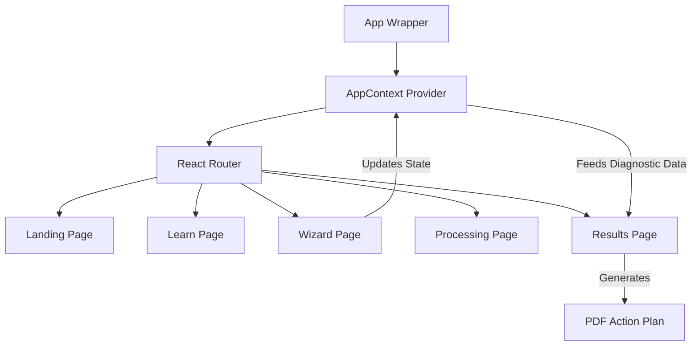

# DBT Compass
> Aadhaar Seeding Diagnostic Platform

## Elevator Pitch
DBT Compass is a client-side diagnostic application designed to help Indian citizens identify why government Direct Benefit Transfers (DBT) fail to reach their bank accounts. It targets farmers, students, and rural workers who frequently experience subsidy rejection due to complex Aadhaar-NPCI mapping rules. By simulating an NPCI mapper check through a guided form, it removes the ambiguity around account seeding and generates a specific, actionable PDF resolution plan.

## Key Features

### Bilingual Accessibility (English/Hindi)
The application provides full UI translation and dynamic Text-to-Speech (TTS) coverage to support users with low literacy. This is implemented via state-mapped language dictionaries in `src/pages` and the browser-native `SpeechSynthesisUtterance` API, which binds the translated strings to an audio output queue.

### Strict Client-Side Data Validation
The diagnostic wizard prevents users from submitting conflicting account states. This is enforced using `react-hook-form` coupled with `@hookform/resolvers/zod` in `src/pages/Wizard.jsx`, ensuring that form state is strictly typed against a predefined schema before advancing steps.

### Centralized State Persistence
User inputs from the multi-step wizard are preserved across route transitions without relying on local storage or URL parameters. This is achieved using the React Context API (`src/context/AppContext.jsx`), which wraps the router and passes the global state layer down to page components.

### Client-Side Action Plan Generation
Upon completing the diagnostic, the application provides a personalized resolution document. This is implemented using `html2pdf.js` in `src/pages/Results.jsx`, which directly converts the DOM nodes of the results component into a downloadable PDF blob.

## Architecture Overview



**Walkthrough:**
A user lands on the application, passing through the `App.jsx` entry point which initializes the `AppContext`. As they navigate to the Wizard, `react-hook-form` captures their Aadhaar number, bank selection, and account health data. This data is passed up to `AppContext` upon successful Zod validation. The router then transitions to the Processing view (a simulated loading delay), and finally to the Results view, where the context data is evaluated against hardcoded diagnostic rules (e.g., dormant account overrides NPCI seeding success). The final output is rendered and available for PDF export.

## Tech Stack

| Tool | Usage in Project |
|---|---|
| **React.js** | Core component architecture and UI rendering layer. |
| **Vite** | Build tool and development server for fast HMR and optimized bundling. |
| **Tailwind CSS** | Utility-first styling for responsive, mobile-first layouts. |
| **Framer Motion** | Hardware-accelerated animations for page transitions and wizard step changes. |
| **React Hook Form** | Form state management and input capture in the diagnostic wizard. |
| **Zod** | Schema definition and strict validation rules for the wizard inputs. |
| **HTML2PDF.js** | Client-side conversion of the results view into a downloadable PDF document. |

## Robustness & Edge-Case Handling
- **Input Validation:** Enforced in `src/pages/Wizard.jsx` using a Zod schema. If a user attempts to proceed without selecting a mandatory field, error boundaries block the transition and display localized error messages.
- **State Protection:** The application routes depend on the `AppContext`. Navigating directly to `/results` without completing the wizard yields a generic fallback state rather than a crash.
- **Responsive Degradation:** Grids in `src/pages/Landing.jsx` use a `gap-px` border strategy rather than `divide-x` to ensure borders do not break when wrapping to single columns on narrow mobile screens.
- **Audio Cleanup:** The `SpeechSynthesis` API queue is actively cleared in a `useEffect` cleanup return function across pages to prevent audio from overlapping if a user navigates away mid-sentence.

## Project Structure
```
src/
├── assets/          
├── components/      
├── context/
│   └── AppContext.jsx 
├── data/            
├── pages/           
├── utils/           
├── App.css          
├── App.jsx          
├── index.css        
└── main.jsx         
```

## Setup & Installation

```bash
npm install
npm run dev
```

## Environment Variables
This project currently operates entirely client-side and requires no environment variables.

## Known Limitations / Roadmap
- **No Backend Integration:** The "Processing" step simulates an API call. A Node.js/Express backend is required to actually interface with an NPCI mapper or a secure mock database.
- **Client-Side Only Authentication:** There is currently no user authentication implemented.
- **Data Persistence:** Because state is held in React Context memory, refreshing the browser mid-wizard will wipe the user's progress.

## Pitch Cheat Sheet

- **The Problem:** Indian citizens frequently have government subsidies bounce because they unknowingly violate complex, single-account NPCI mapping rules.
- **Who it's for:** Farmers, students, and rural workers who lack technical financial literacy.
- **3 Standout Technical Decisions:**
  1. Relying strictly on client-side Zod validation to ensure users cannot submit impossible account configurations.
  2. Leveraging the native Web Speech API mapped directly to React state to provide zero-dependency audio localization.
  3. Using a Context API wrapper rather than URL parameters to keep sensitive inputs out of the browser history.
- **The Hardest Problem Solved:** Ensuring continuous, overlap-free audio playback that correctly handles language switching mid-sentence by aggressively managing the global `SpeechSynthesisUtterance` queue in component cleanup phases.
- **30-Second Pitch:** DBT Compass is a React-based diagnostic platform that helps citizens figure out why their government subsidies are failing. By simulating complex bank routing rules via a guided, accessible UI, it prevents users from guessing their account status and instead generates a precise, downloadable action plan to hand to their bank branch.
- **2-Minute Pitch:** Government subsidies in India route through a single, exclusive NPCI mapping link. When users change banks or let accounts go dormant, this link breaks silently. DBT Compass is a frontend diagnostic tool that removes this friction. It provides a highly accessible, bilingual interface with full text-to-speech coverage for rural users. Under the hood, it uses a strict Zod-validated React Hook Form to gather account health metrics, processes them through a centralized Context API, and evaluates the data against known NPCI failure states. The result is a seamless, client-side application that instantly generates a customized PDF resolution document—saving users trips to the bank and ensuring their funds reach them.
